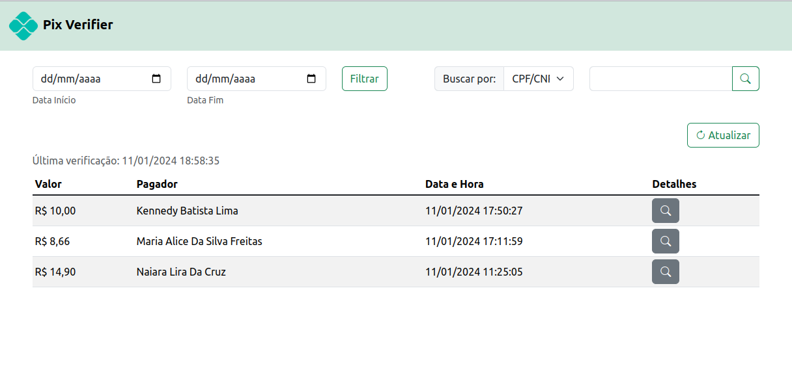

# Pix Verifier

Esse projeto utiliza a API oficial do Banco Inter para obter todas as transferências recebidas via Pix do dia e salvar em um banco de dados PostgreSQL para posterior visualização através de um script em PHP.

Desenvolvi esse projeto, pois tenho um comércio onde os clientes pagam pelo Pix e precisava de alguma forma que os meus colaboradores pudessem confirmar a transferência efetuada pelos clientes.

O projeto deve rodar tanto em Linux quanto em Windows, desde que instaladas as dependências necessárias em cada sistema.

| Dependência | Versão |
|     --      |   --   |
| PostgreSQL |   16   
| Python |3.10.12 
| psycopg2-binary (Python)| 2.9.9
| requests (Python) | 2.25.1
| PHP | 8.1.2
| PHP PDO PostgreSQL | -

## Como funciona
O projeto é divido em dois scripts, o `pix.py` e o `pix.php`.

- `pix.py` - É o script responsável por fazer as chamadas a API do Banco Inter, e salvar no bando de dados. O script fica executando em loop1, onde a cada 10 segundos baixa as transferêcias recebidas via Pix **do dia**2.

- `pix.php` - É o script que gera a página de visualização dos dados salvos.

> **1.** Mais abaixo mostro um exemplo criando um serviço no `Systemd` do Linux e executando em background quando o sistema é iniciado.
> 
> **2.** Em condições ideais de temperatura e pressão, o ideal seria um **webhook** para receber as *callbacks*, porém, atualmente o Banco Inter não disponibiliza callbacks via webhook para as transferências recebidas via Pix, a não ser quando tratar-se de **Cobrança Pix**, que são as cobranças onde se gera uma cobrança via Pix com o valor já especificado.

## Antes de começar

Para que seja possível usar a API, é preciso criar uma aplicação através do Internet Banking, e escolher no escopo `Internet Baking` a opção `Extrato`. Segue abaixo link para a documentação oficial do Banco Inter onde ensina como criar uma aplicação e obter o `ClientID`, `ClientSecret`e os certificados para descriptografar os dados recebidos pela API.

[Documentação Oficial: Como criar uma aplicação?](https://developers.inter.co/docs/introducao/como-criar-uma-aplicacao)

### !!! Importante !!!
No momento o uso das APIs estão disponíveis somente para correntistas PJ. **Não há API disponível para os correntistas pessoa física.**
 
 ## Configurações

### `Pix.py`

##### Banco de dados:

    # PostegreSQL
    dbhost = "ip_do_servidor_postgresql"
    dbname  =  "pix"
    dbuser  =  "nome_de_usuario"
    dbpass  =  "senha_do_banco_de_dados"

##### ClientID e ClientSecret

Forneça a ClientID e a ClientSecret obtida no momento da criação da apliação no Internet Banking.

    # Dados de acesso
    client_id  =  "clientid_da_sua_aplicacao"
    client_secret  =  "clientsecret_da_sua_aplicacao"
    scope  =  "extrato.read"

Não altere a linha scope, ela é necessário para a criação do Token OAuth que vai autenticar as requisições.

##### Certificados

    # Certificados
    cert_path  =  "./certs/inter.crt"
    key_path  =  "./certs/inter.key"

Extraia o certificado e a chave gerada para a sua aplicação na parte `/certs/` e ajuste o nome para a bater com o nome do seu arquivo, ou renomeie para `inter.crt` e `inter.key`.

##### Lista de Ignorados

Pode ser que no seu caso, assim como eu, você não deseja que o script salve as transferencias de CPFs ou CPNJs especifícos, no meu caso por exemplo, não quero que seja salvo transferencias recebidas de outras contas do CNPJ da empresa, e as transferências que eu fizer da minha conta.

Para isso, basta incluir o numero do CPF/CNPJ na lista `ignoredSender`:

    # Lista de com o CPF/CNPJ que deverá ser ignorado e não salvar no banco de dados
    ignoredSender  = ['01234567890', '01234567888899']

Se quiser salvar todos sem distinção, basta deixar a lista vazia.

    ignoredSender = []

### `Pix.php`

Aqui basta apenas ajustar a configurações de acesso ao PostgreSQL:

    //Banco de Dados
    $db_server =  'ip_do_servidor_postgresql';
    $db_name =  'pix';
    $db_user =  'nome_de_usuario';
    $db_pass =  'senha_do_banco_de_dados';

Coloque o arquivo em um servidor Web para ter acesso aos dados gravados no banco de dados. 

> **Importante**
> O `pix.php`não exige nenhuma autenticação de usuário, logo não recomento hospedar na web. O projeto foi pensado para ser instalado localmente, e ser acessado apenas pelo estabelecimento/comércio.

 ### PostgreSQL

Use o arquivo `database.sql` para criar a estrutura de tabelas do banco de dados. Por padrão o nome do banco de dado é **pix**, caso altere o nome do banco de dados lembre-se de alterar também no `pix.py` e no `pix.php` para não dar erro de conexão.

## Executando o projeto

Feito as configurações acima, basta executar o script python:

    python3 ./pix.py

No comando acima, o script vai ficar executar mas vai travar o terminal, se estiver usando Linux, sugiro criar um serviço e rodar com o Systemd para executar em segundo plano quando o computador ligar.

No Windows o mesmo pode ser feito usando o *Agendador de Tarefas*.

### Executando pelo Systemd no Linux

    sudo nano /usr/lib/systemd/system/pix-verifier.service
   
Cole o conteúdo baixo no arquivo criado:
   
    [Unit]
    Description=Pix Verifier
    After=postgresql.service
    Wants=postgresql.service
    
    [Service]
    Type=idle
    Restart=always
    User=seu_usuario
    ExecStart=/bin/bash -c 'cd /seu/diretorio/pix/ && python3 pix.py'
    
    [Install]
    WantedBy=multi-user.target

Aqui é preciso fazer algumas alteração, e pode ser necessário fazer mais alguns ajustes.

Se o PostgresSQL estiver sendo executado em um conteiner Docker, altere as linhas:

    After=postgresql.service
    Wants=postgresql.service

para:

    After=docker.service
    Wants=docker.service

Verifique também se o nome do serviço do PostgreSQL está correto, usando o comando `sudo systemctl list-units --type=service` para listar os serviços instalados e procurar pelo PostgreSQL. Caso o servidor esteja em outro host, pode apagar as linhas acima.

Altere também `User=seu_usuario` e coloque o nome o seu usuário. E por último na linha `ExecStart=/bin/bash -c 'cd /seu/diretorio/pix/ && python3 pix.py'`substitua o `/seu/diretorio/pix/` para o local onde está salvo o `pix.py`.

E finalmente rode as linhas abaixo no terminal:

    sudo systemctl daemon-reload && \
    sudo systemctl enable pix-verifier.service && \
    sudo systemctl start pix-verifier.service

---
Copyright (c) 2024 Filipe Bezerra

Permission is hereby granted, free of charge, to any person obtaining a copy of this software and associated documentation files (the “Software”), to deal in the Software without restriction, including without limitation the rights to use, copy, modify, merge, publish, distribute, sublicense, and/or sell copies of the Software, and to permit persons to whom the Software is furnished to do so, subject to the following conditions:

The above copyright notice and this permission notice shall be included in all copies or substantial portions of the Software.

THE SOFTWARE IS PROVIDED “AS IS”, WITHOUT WARRANTY OF ANY KIND, EXPRESS OR IMPLIED, INCLUDING BUT NOT LIMITED TO THE WARRANTIES OF MERCHANTABILITY, FITNESS FOR A PARTICULAR PURPOSE AND NONINFRINGEMENT. IN NO EVENT SHALL THE AUTHORS OR COPYRIGHT HOLDERS BE LIABLE FOR ANY CLAIM, DAMAGES OR OTHER LIABILITY, WHETHER IN AN ACTION OF CONTRACT, TORT OR OTHERWISE, ARISING FROM, OUT OF OR IN CONNECTION WITH THE SOFTWARE OR THE USE OR OTHER DEALINGS IN THE SOFTWARE.