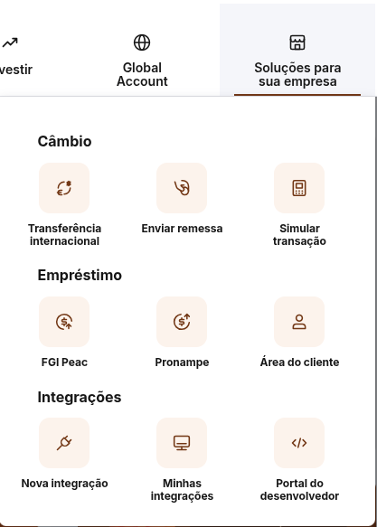
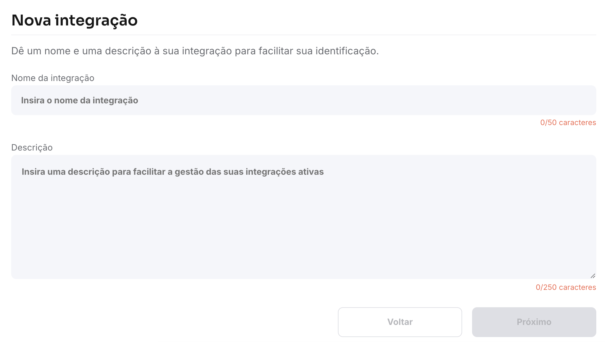
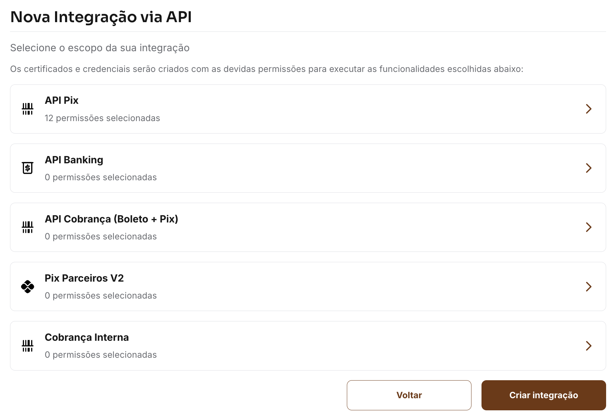
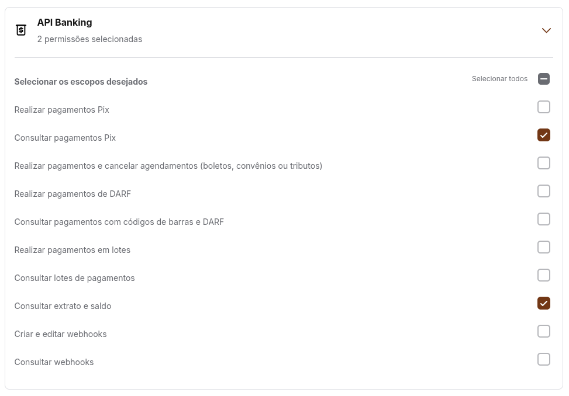
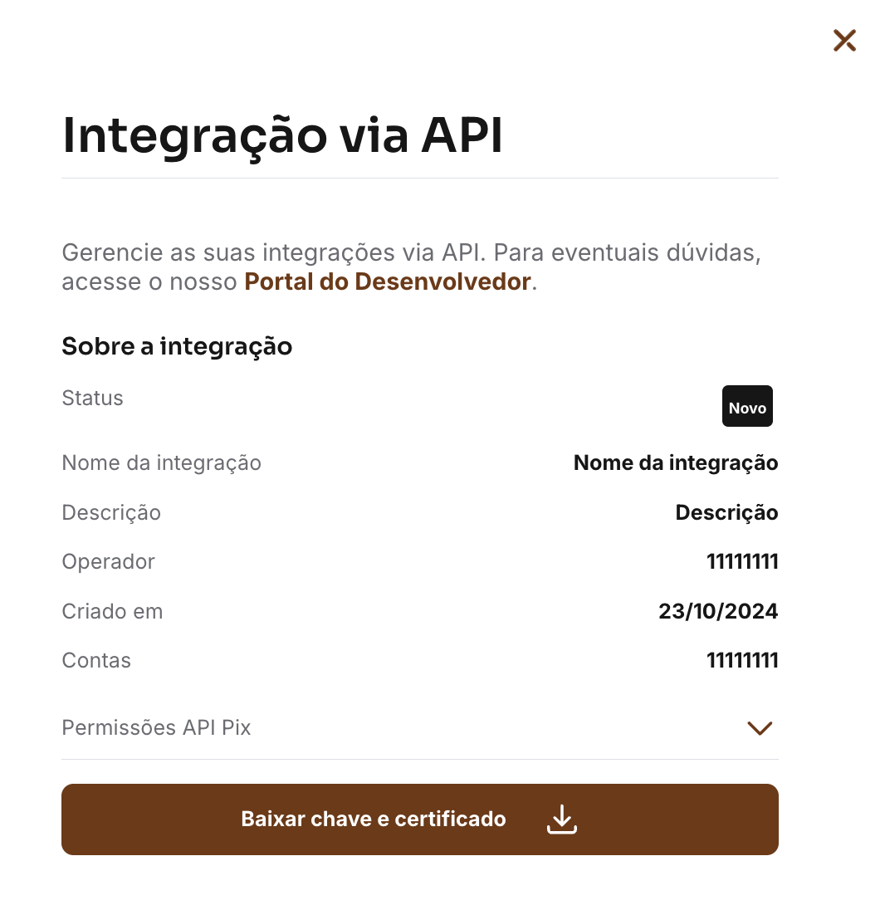
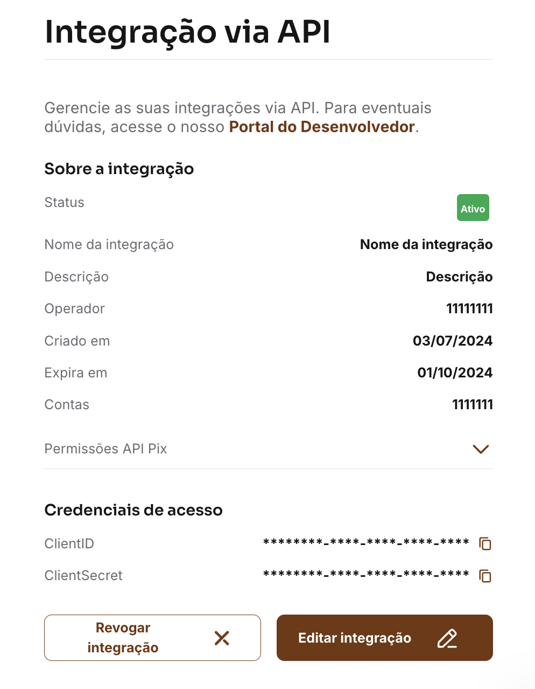

# **Banco Inter**

## **Introdução**

O Banco Inter disponibiliza o acesso gratuito as _APIs_, mas somente aos clientes **Pessoa Jurídica**, então se sua conta for Pessoa Física infelizmente não será possível fazer as conciliações dos Pixs na sua conta através do Pix Verifier.

Para utilizar o Pix Verifier será necessário criar uma integração onde o Inter vai disponibilizar duas chaves, o _ClientID_ e o _ClientSecret_, além de um certificado e chave para criptografar a comunicação com banco.

### **Criando uma integração**

Primeiramente faça o login na sua conta PJ pelo [Internet Banking](https://contadigital.inter.co/).

Clique em **Soluções para sua empresa**, e em seguida **Nova integração**.

Na tela de nova integração, crie um nome e uma descrição para facilitar a identificação.

### **Escopo da integração**

Agora você deverá selecionar o escopo da integração.

Isso significa que se você diz que uma integração tem acesso somente a consultar o extrato, ela não vai poder ser usada para aprovar um pagamento por exemplo. É uma camada a mais de segurança, e como o Pix Verifier apenas realiza consultas, selecione apenas as opções `Consultar pagamentos Pix` e `Consultar extrato e saldo`.

Clique no botão **Criar integração** para finalizar. 

### **Credenciais de acesso e certificado**

Após a criação, você será direcionado à tela Gestão de Integrações, onde sua integração será exibida com o status "Novo". Expandindo os detalhes você poderá ver mais algumas informações sobre a integração, como quais permissões e as contas correntes que está associada. Nesta tela você encontrará o botão para baixar a chave e certificado.

!!! warning "ATENÇÃO"
    Essa tela é exibida somente **UMA ÚNICA VEZ**, depois que você fizer o download não tem como fazer o download novamente, sendo necessário criar uma nova integração. Portando após a configuração do Pix Verifier recomendo guardar esse certificado num pendrive e em local seguro.

Ao baixar a chave privada e o certificado, as respectivas credenciais serão geradas e exibidas na mesma tela de detalhes, enquanto a integração passará por um processo de validação. Após alguns minutos, o status será atualizado para Ativo e a integração estará pronta para utilização.

As credenciais de acesso podem ser acessadas a qualquer tempo, diferente do certificado que só pode ser baixado uma única vez. Anote o _ClientID_ e o _ClientSecret_ que será necessário para configurar o Pix Verifier.

!!! warning "VALIDADE DO CERTIFICADO"
    O certificado tem validade de 1 ano a partir da geração do mesmo. Após esse tempo uma nova integração deverá ser criada, ou renovar a existente para que seja emitido um novo certificado.

!!! warning "SEGURANÇA DA CONTA"
    O _ClientID_ e o _ClientSecret_ são credenciais privadas de acesso à sua conta e não devem ser compartilhadas em locais públicos.
