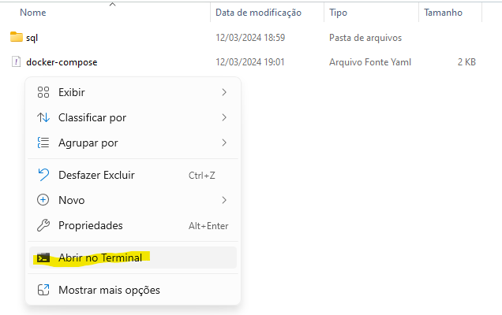
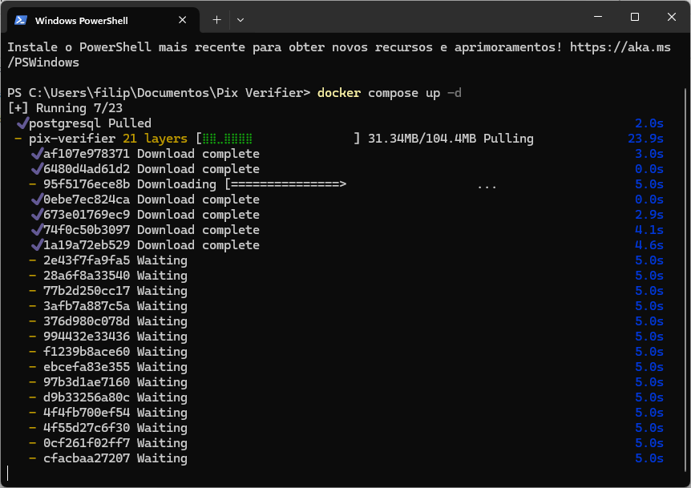
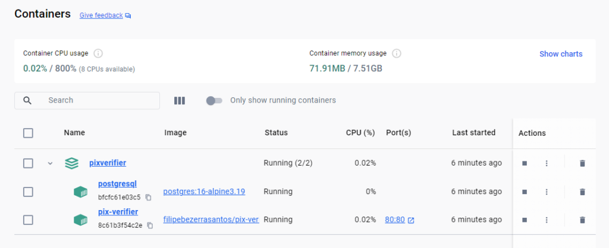
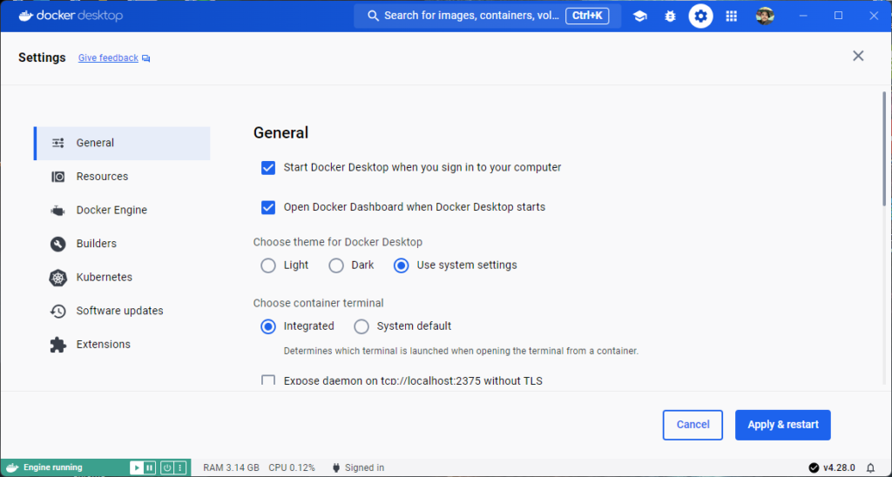

# **Instalando o Docker**

Primeiramente, baixe o **Docker Desktop** no site do Docker:

> [https://www.docker.com/products/docker-desktop/](https://www.docker.com/products/docker-desktop/)

!!! nota
    Para o sistema operacional Windows, existe duas versões para download, **AMD64** e **ARM64**, contudo o Pix Verifier deve ser executado em uma plataforma **AMD64**!

Execute o instalador e basta seguir o padrão de instalação Windows (_next, next, next e finish_).

## **Preparando os arquivos**

### **Docker Compose**

Se você baixou o repositório do Github, localize dentro da pasta onde você baixou, o arquivo `docker-compose.yaml`, ou crie uma pasta e dentro dela crie um novo arquivo chamado `docker-compose.yaml`, abra o editor e cole o conteúdo abaixo:


``` yaml title="docker-compose.yaml" linenums="1"
services:
  postgres:
    container_name: postgres
    image: postgres:16-alpine3.19
    hostname: postgres16
    restart: unless-stopped
    volumes:
      - postgres_data:/var/lib/postgresql/data
      - ./sql:/docker-entrypoint-initdb.d
    environment:
      - TZ=America/Fortaleza
      - POSTGRES_USER=dbadmin
      - POSTGRES_PASSWORD=SENHA_BANCO_DE_DADOS
    ports:
      - "5432:5432"
    networks:
      - pixverifier_network

  pix-verifier:
    image: filipebezerrasantos/pix-verifier:v2.0
    hostname: pix-verifier
    container_name: pix-verifier
    restart: unless-stopped
    environment:
      - TZ=America/Fortaleza
      - DB_HOST=postgres
      - DB_NAME=pixverifier
      - DB_USER=dbadmin
      - DB_PASS=SENHA_BANCO_DE_DADOS
    volumes:
      - pixverifier_certs:/var/www/services/certs
    ports:
      - "80:80"
    networks:
      - pixverifier_network

volumes:
  postgres_data:
    name: postgres_data
  pixverifier_certs:
    name: pixverifier_certs

networks:
  pixverifier_network:
    name: pixverifier_network
```

Nesse arquivos estamos criando um serviço com dois containers, o **postgres** que é o nosso banco de dados, e o **pix-verifier**, que é o sistema em si.

Para melhorar a segurança, sugiro que altere as linhas abaixo no serviço do **postgres**:

``` yaml title="docker-compose.yaml >> postgres" linenums="10" hl_lines="4"
    environment:
        - TZ=America/Fortaleza
        - POSTGRES_USER=dbadmin
        - POSTGRES_PASSWORD=SENHA_BANCO_DE_DADOS
```

Crie uma senha segura para o Postgres, e coloque esse mesma senha nas variáveis do **pix-service**:

``` yaml title="docker-compose.yaml >> pix-service" linenums="24" hl_lines="6"
    environment:
      - TZ=America/Fortaleza
      - DB_HOST=postgres
      - DB_NAME=pixverifier
      - DB_USER=dbadmin
      - DB_PASS=SENHA_BANCO_DE_DADOS
```

Com isso finalizamos a configuração dos serviços.

---

### **Schema do banco de dados**

Na mesma pasta onde criou o `docker-compose.yaml`, crie uma nova pasta e dentro dela crie um arquivo chamado `database.sql` e cole o conteúdo abaixo:

``` sql title="database.sql" linenums="1"
SET statement_timeout = 0;
SET lock_timeout = 0;
SET idle_in_transaction_session_timeout = 0;
SET client_encoding = 'UTF8';
SET standard_conforming_strings = on;
SELECT pg_catalog.set_config('search_path', '', false);
SET check_function_bodies = false;
SET xmloption = content;
SET client_min_messages = warning;
SET row_security = off;

SET default_tablespace = '';

SET default_table_access_method = heap;

CREATE TABLE public.bank (
    bankid integer NOT NULL,
    bankname character varying(100) NOT NULL
);


ALTER TABLE public.bank OWNER TO dbadmin;

CREATE TABLE public.bankaccount (
    accountid integer NOT NULL,
    accountname character varying(30) NOT NULL,
    bankid integer NOT NULL,
    branchnumber character varying(10) NOT NULL,
    accountnumber character varying(20) NOT NULL,
    clientid character varying(100),
    clientsecret character varying(100),
    certfile character varying(100),
    certkeyfile character varying(100),
    accesstoken character varying(100),
    tokenexpireat timestamp without time zone,
    ignoredsenders text
);


ALTER TABLE public.bankaccount OWNER TO dbadmin;

CREATE SEQUENCE public.bankaccount_accountid_seq
    AS integer
    START WITH 1
    INCREMENT BY 1
    NO MINVALUE
    NO MAXVALUE
    CACHE 1;


ALTER SEQUENCE public.bankaccount_accountid_seq OWNER TO dbadmin;

ALTER SEQUENCE public.bankaccount_accountid_seq OWNED BY public.bankaccount.accountid;

CREATE TABLE public.receivedpix (
    e2eid character varying(100) NOT NULL,
    date timestamp without time zone NOT NULL,
    value numeric(15,2) NOT NULL,
    payer character varying(100) NOT NULL,
    payerdoc character varying(100) NOT NULL,
    description character varying(140),
    payerbank character varying(100) NOT NULL,
    banktransaction text,
    accountid integer NOT NULL
);


ALTER TABLE public.receivedpix OWNER TO dbadmin;

CREATE TABLE public.users (
    user_id integer NOT NULL,
    username character varying(20) NOT NULL,
    pwd character varying(64) NOT NULL,
    useraccess integer NOT NULL
);


ALTER TABLE public.users OWNER TO dbadmin;

CREATE SEQUENCE public.users_user_id_seq
    AS integer
    START WITH 1
    INCREMENT BY 1
    NO MINVALUE
    NO MAXVALUE
    CACHE 1;


ALTER SEQUENCE public.users_user_id_seq OWNER TO dbadmin;

ALTER SEQUENCE public.users_user_id_seq OWNED BY public.users.user_id;

ALTER TABLE ONLY public.bankaccount ALTER COLUMN accountid SET DEFAULT nextval('public.bankaccount_accountid_seq'::regclass);

ALTER TABLE ONLY public.users ALTER COLUMN user_id SET DEFAULT nextval('public.users_user_id_seq'::regclass);

ALTER TABLE ONLY public.bank
    ADD CONSTRAINT bank_pk PRIMARY KEY (bankid);

ALTER TABLE ONLY public.bankaccount
    ADD CONSTRAINT bankaccount_pk PRIMARY KEY (accountid);

ALTER TABLE ONLY public.receivedpix
    ADD CONSTRAINT receivedpix_pk PRIMARY KEY (e2eid);

ALTER TABLE ONLY public.users
    ADD CONSTRAINT users_id_pk UNIQUE (user_id);

CREATE INDEX receivedpix_accountid_idx ON public.receivedpix USING btree (accountid);

ALTER TABLE ONLY public.bankaccount
    ADD CONSTRAINT bankaccount_bank_fk FOREIGN KEY (bankid) REFERENCES public.bank(bankid) ON UPDATE CASCADE ON DELETE CASCADE;


ALTER TABLE ONLY public.receivedpix
    ADD CONSTRAINT receivedpix_bankaccount_fk FOREIGN KEY (accountid) REFERENCES public.bankaccount(accountid) ON UPDATE CASCADE ON DELETE CASCADE;

INSERT INTO public.users (username, pwd, useraccess) 
VALUES ('admin', '$2y$10$Ve1qGNP9X.7nThu4LXOwVuWc57jN3PhvYl.b/ABFEuw8nE3LPSDVe', 2);

```

Esse arquivo tem a estrutura do banco dados que o Pix Verifier precisa para funcionar. Ao final sua estrutura de diretórios deve estar mais ou menos assim:

```
pix-verifier/
├─ sql/
│  ├─ database.sql
├─ docker-compose.yaml
```

---

## **Iniciando o serviço**

Primeiramente verifique se o Docker está em execução, depois clique com o botão direito dentro da pasta onde você criou os arquivos, no menu suspenso clique em **Abrir no Terminal**.



Abrindo a janela do terminal estando na mesma pasta dos arquivos criados, é só digitar o comando `docker compose up -d` e aguardar o download das imagens.



Quando terminar o download o Docker vai automaticamente subir os serviços, se você voltar lá no Docker Desktop deverá ver algo semelhante a imagem abaixo, agora acesse no seu navegador `http://localhost`, se aparecer a página inicial do Pix Verifier significa que os containers subiram corretamente, restando apenas agora a configuração final para começar a funcionar.



### **Iniciar o Docker junto ao Windows**

No arquivo do `docker-compose.yaml` os containers estão configurados para iniciarem automaticamente a menos que você dê o comando para para o container, contudo, para que isso funcione o Docker Desktop também precisar ser habilitado junto ao Windows.

Abra o Docker Desktop e clique na engrenagem na barra superior, na tela que foi apresentada marque a caixa que diz **Start Docker Desktop when you sign in to your computer** e por último clique em **Apply & Restart**.

