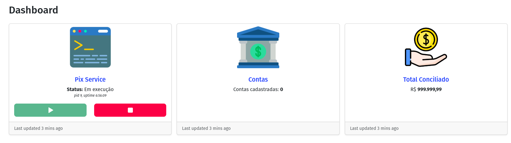
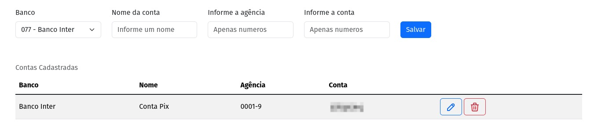
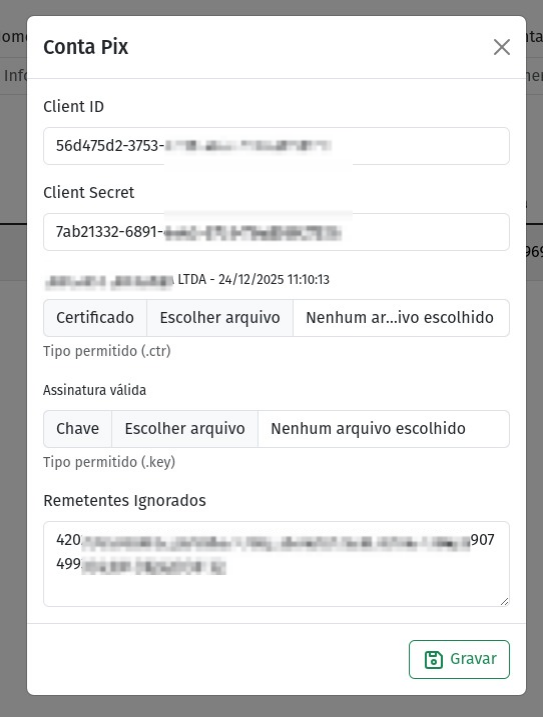
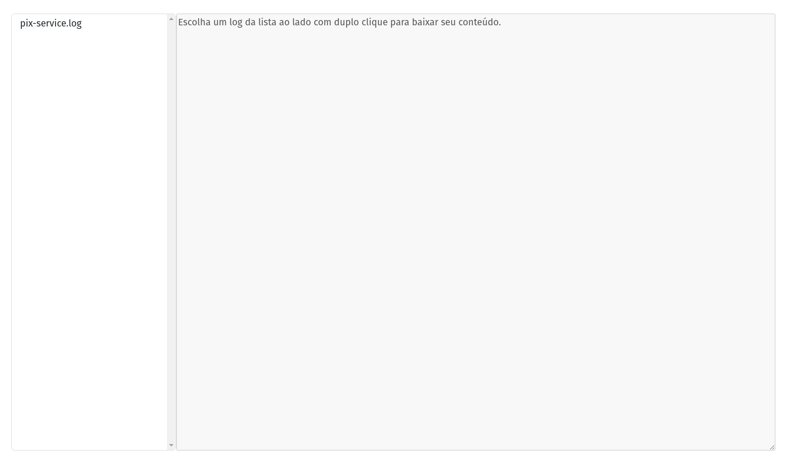

# **Administração**

No painel administrativo é onde se cadastra as contas, controla o Pix Service e consulta os logs do sistema. Ele é dividido em três páginas, _**Dashboard**_, _**Contas**_ e _**Logs**_. 

!!! note "Credenciais de acesso"
    Para acessar a administração, o usuário e senha padrão é _admin_. 

## **Dashboard**

No dashboard é onde se habilita ou desabilita o Pix Service, além disso o sistema exibe quantas contas estão cadastradas e o valor total conciliado pelo Pix Verifier.

---

## **Contas**

### Cadastrar nova conta

Para cadastrar um nova conta, informe os seguintes dados:

- Nome da conta para identificação. _Exemplo: Loja Matriz_;
- Código da agência;
- Número da conta.

Em seguida clique em **Salvar**.

!!! info "Importante"
    Não é possível adicionar contas iguais para a mesma agência.

### Detalhes da conta

As contas que são criadas ficam listadas na tabela `Contas Cadastradas`. Após criar uma conta é necessário editar os detalhes para que o Pix Service inicie o monitoramento.

Para editar uma conta clique no botão :octicons-pencil-16: e será aberto uma janela para que insira as credenciais de acesso, certificados e possíveis remetentes ignorados.

É aqui onde você deve colocar o _ClientID_, _ClientSecret_ e fazer o upload do certificado e chave que você baixou quando [criou a integração lá no Internet Banking](../banks/inter.md).

#### Remetentes ignorados

Esse é um recurso que você utiliza quando quer que o Pix Verifier ignore certos remetentes, dessa forma toda transação recebida desse CPF ou CNPJ não será salva e nem exibida na tabela de transações da página principal. 

Para cadastrar basta digitar o CPF ou CNPJ sem nenhuma pontuação, **apenas números**. Para adicionar mais de um remetente ignorado separe por `;` _(ponto e vírgula)_.

!!! info "Importante"
    Toda alteração no detalhe da conta para que surta efeito é preciso reiniciar o Pix Service. No _dashboard_ pare o serviço e em seguida inicie novamente, assim o Pix Service carrega as informações atualizadas.

### Deletar conta

Caso precise deletar uma conta é só clicar no botão :octicons-trash-24: e confirmar.

!!! danger "CUIDADO"
    Esse é um processo **irreversível**, ao deletar uma conta, todos os Pix conciliados e dados dessa conta também serão apagados!

---

## **Logs**

Nessa seção é onde você pode acompanhar os logs do Pix Service.

Do lado esquerdo encontra-se a lista de logs disponíveis. O comportamento padrão do Pix Service é rotacionar os logs quando atingirem 10MB, e manter os últimos 5 arquivos de log. Então, ao rotacionar o log, o log atual será renomeado para _pix-service.log.1_ e assim por diante. 

Para selecionar um arquivo de log dê um clique duplo no nome do arquivo, ao selecionar o _pix-service.log_ e enquanto estiver selecionado, o auto update estará ativo e atualizando o log.

Com excessão do _pix-service.log_ todos os arquivos de log quando baixados exibem o conteúdo completo, enquanto o log atual exibe apenas as 50 últimas linhas.