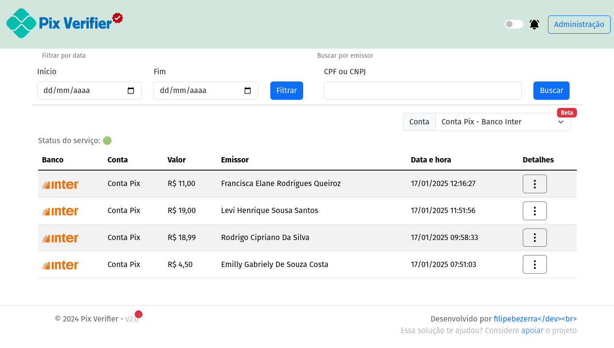
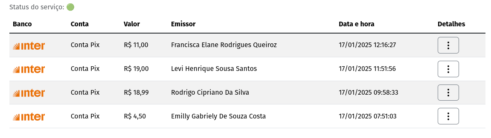
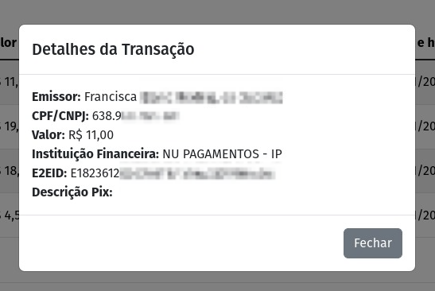
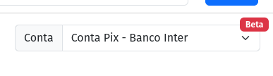
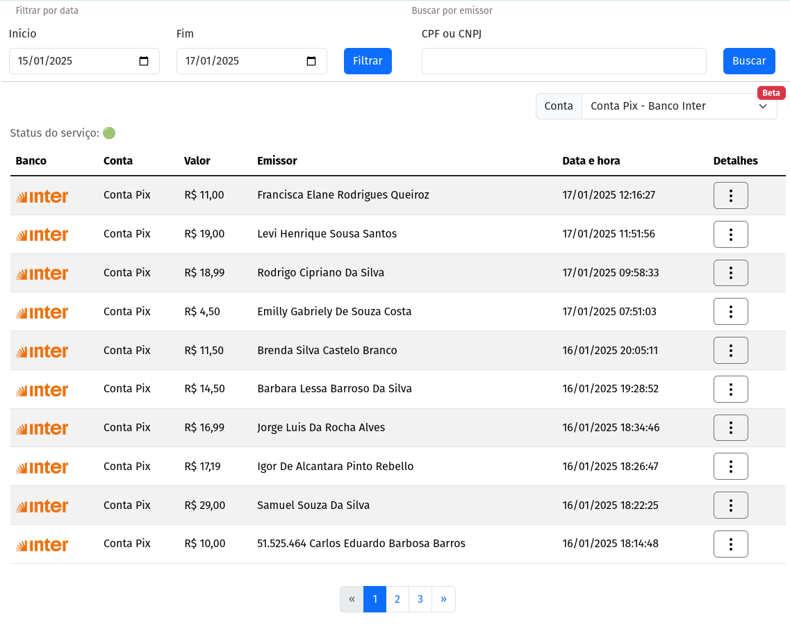

# **Página Principal**

## **Visão Geral**

A utilização do Pix Verifier é bem simples, basicamente tudo está na página principal, sendo possível **filtrar por data**, **buscar por emissor** ou **escolher a conta que deseja monitorar**, uma vez que é possível cadastrar mais de uma conta.

Na barra superior do lado direto há o _switch_ para habilitar as notificações via áudio e o botão para o painel administrativo do Pix Verifier. Na parte principal da página, as transações são apresentadas de forma tabular.

### **Tabela de transações**

Na tabela de transações, são exibidas as transferências que foram conciliadas pelo _Pix Service_, são ordenadas de forma decrescente, ou seja, as últimas transferências recebidas são exibidas primeiro, apresentando as informações básicas como o banco, conta que recebeu o crédito, valor, nome do pagador, data e hora  da transação.

Por padrão a tabela vai ser preenchida com as últimas 10 transações, exibindo os botões de paginação caso haja mais de transações recebidas no dia.

#### Detalhes da transação

No campo `Detalhes`, clicando no botão :material-dots-vertical:, o sistema busca e exibe na tela as informações adicionais da transação.

#### Status do Serviço

O Pix Verifier é composto por dois serviços, o _Pix Verifier WEB_ e o _Pix Service_, sendo esse último o que roda em _background_ fazendo as consultas nas _APIs_ e salvando no banco de dados as transferências Pix. Esse item pode apresentar dois estados diferentes:

> Status do serviço: 🟢

Indica que o Pix Service está operante, é esperado que as transações recebidas sejam atualizadas na tabela.

> Status do serviço: 🔴

Indica que o Pix Service não está em execução. Verificar no painel administrativo detalhes do status e consultar os logs.

#### Seletor de contas

O Pix Verifier permite que você cadastre mais de uma conta para monitorar, para verificar as transações recebidas nas outras contas, basta escolher a conta na lista.

### **Filtrar por data**

É possivel consultar as transações de datas anteriores informado a data de início e a data final. O padrão de exibição na tabela de transações é o mesmo, com as 10 últimas transações do período selecionado.

> Exemplo: Ao filtrar as transações do dia 15/01/2025 até 17/01/2025 a tabela de transações será preenchida a partir da última transação recebida do dia 17/01/2025, exibindo as 10 últimas e habilitando a paginação caso necessário.

### **Buscar por emissor**

A busca por emissor vai retornar todas as transações recebidas do CPF/CNPJ informado. Basta informa o CPF ou CNPJ sem pontuação ou caracteres especiais e clicar em **Buscar**.

### **Verificador de atualização**

No rodapé da página do lado esquedo na informação de _copyright_ há um indicador que existe uma nova versão disponível do Pix Verifier. Esse indicador é representado por um pequeno círculo vermelho que ao passar o mouse por cima informa qual a nova versão disponível no Github.

### **Notificação por áudio**

Além da indicação visual quando uma nova transação é recebida, há também a possibilidade de habilitar uma notificação por áudio. Para ativar, clique no _switch_ localizado ao lado do botão **Administração** na barra superior da página.